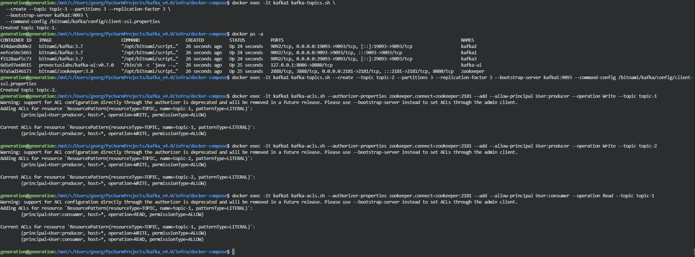

# Отчёт по настройке SSL и ACL в кластере Kafka

## 1. Генерация сертификатов

- Использован скрипт: `src/utils/ssl_generator.py`
- Конфиг: `infra/docker-compose/ssl/config/kafka_broker.cnf`
- Сертификаты и truststore сгенерированы для каждого брокера и помещены в `infra/docker-compose/ssl/certificates/`

## 2. Запуск кластера с SSL

```bash
$ docker compose up --build
```

## 3. Создание топиков

```bash
$ docker exec -it kafka1 kafka-topics.sh --create --topic topic-1 --partitions 3 --replication-factor 3 --bootstrap-server kafka1:9093 --command-config /bitnami/kafka/config/client-ssl.properties
$ docker exec -it kafka1 kafka-topics.sh --create --topic topic-2 --partitions 3 --replication-factor 3 --bootstrap-server kafka1:9093 --command-config /bitnami/kafka/config/client-ssl.properties
```

## 4. Настройка ACL

- Для topic-1: разрешён доступ продюсерам и консьюмерам.
- Для topic-2: разрешён только продюсер, консьюмерам запрещён доступ.

Пример команд для ACL:

```bash
# Разрешить продюсеру писать в оба топика
$ docker exec -it kafka1 kafka-acls.sh --authorizer-properties zookeeper.connect=zookeeper:2181 --add --allow-principal User:producer --operation Write --topic topic-1
$ docker exec -it kafka1 kafka-acls.sh --authorizer-properties zookeeper.connect=zookeeper:2181 --add --allow-principal User:producer --operation Write --topic topic-2

# Разрешить консьюмеру читать только topic-1
$ docker exec -it kafka1 kafka-acls.sh --authorizer-properties zookeeper.connect=zookeeper:2181 --add --allow-principal User:consumer --operation Read --topic topic-1
```

## 5. Тестирование доступа

- Продюсер и консьюмер для topic-1 работают корректно.
- Для topic-2 консьюмер не может читать сообщения (ошибка доступа).

## 6. Примеры кода

- См. `src/producers/ssl_producer.py` и `src/consumers/ssl_consumer.py` для примеров подключения по SSL.

## 7. Проблемы и их решение

- Если не совпадают пути к сертификатам — брокеры не стартуют.
- Если не заданы ACL — доступ запрещён по умолчанию.

## 8. Выводы

- Кластер успешно работает по SSL.
- ACL корректно ограничивают доступ к топикам. 

## 9. Скриншот

