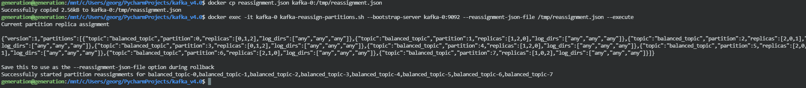

# Отчёт по балансировке партиций и диагностике кластера Kafka

## 1. Запуск кластера

```bash
# Запуск кластера KRaft
$ docker-compose -f docker-compose.kraft.yml up -d
```

## 2. Создание топика

```bash
$ docker exec -it kafka-0 kafka-topics.sh --create --topic balanced_topic --partitions 8 --replication-factor 3 --bootstrap-server kafka-0:9092
```

## 3. Получение текущего распределения партиций

```bash
$ docker exec -it kafka-0 kafka-topics.sh --describe --topic balanced_topic --bootstrap-server kafka-0:9092
```

## 4. Пример reassignment.json


```json
{
  "version": 1,
  "partitions": [
    {"topic": "balanced_topic", "partition": 0, "replicas": [0,1,2]},
    {"topic": "balanced_topic", "partition": 1, "replicas": [1,2,0]},
    {"topic": "balanced_topic", "partition": 2, "replicas": [2,0,1]},
    {"topic": "balanced_topic", "partition": 3, "replicas": [0,2,1]},
    {"topic": "balanced_topic", "partition": 4, "replicas": [1,0,2]},
    {"topic": "balanced_topic", "partition": 5, "replicas": [2,1,0]},
    {"topic": "balanced_topic", "partition": 6, "replicas": [0,1,2]},
    {"topic": "balanced_topic", "partition": 7, "replicas": [1,2,0]}
  ]
}
```

## 5. Применение reassignment

```bash
$ docker cp reassignment.json kafka-0:/tmp/reassignment.json
$ docker exec -it kafka-0 kafka-reassign-partitions.sh --bootstrap-server kafka-0:9092 --reassignment-json-file /tmp/reassignment.json --execute
```

## 6. Проверка статуса перераспределения

```bash
$ docker exec -it kafka-0 kafka-reassign-partitions.sh --bootstrap-server kafka-0:9092 --reassignment-json-file /tmp/reassignment.json --verify
```

## 7. Моделирование сбоя брокера

```bash
# Остановить брокер
$ docker stop kafka-1
# Проверить состояние топика
$ docker exec -it kafka-0 kafka-topics.sh --describe --topic balanced_topic --bootstrap-server kafka-0:9092
# Запустить брокер
$ docker start kafka-1
# Проверить восстановление
$ docker exec -it kafka-0 kafka-topics.sh --describe --topic balanced_topic --bootstrap-server kafka-0:9092
```

## 8. Скриншоты терминала





## 9. Выводы

- Перераспределение партиций прошло успешно.
- Кластер корректно реагирует на сбой и восстановление брокера. 